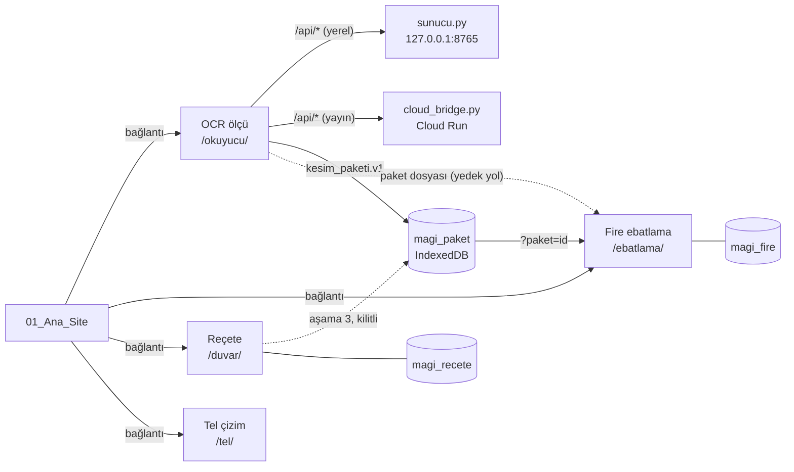

# Mobilyacılar Ağı — Mimari ve Kök Dizin Yol Haritası

> **Hudut:** Kök `.cursorrules` bu belgenin üstündedir; çelişkide o geçerlidir.
> **Nitelik:** Plan belgesidir, kodu değiştirmez. Her adım ayrı onayla uygulanır; bir mesajda tek adım yapılır. Çalıştırma ve yayın ayrıca onay ister.
> **Kapsam:** `Mobilyacılar_Agi_Clean` yan kopyası. Asıl `..\Mobilyacılar_Agi` ve canlı `web.app` bu belgeyle değişmez; canlı yayın bu kopyadan yapılmaz.
> **Dayanak:** 29 Eylül 2026 kod taraması. Satır numaraları o günkü dosyalara göredir.

---

## 1. Özet

Çanta dört araçtan oluşur: **OCR ölçü**, **Fire ebatlama**, **Mobilya İmalat Akıllı Reçete** ve **Tel çizim**. Sunucuya istek atan tek araç OCR'dır. Fire ile Reçete tamamen tarayıcıda çalışır; Tel çizim iskelettir. Araçlar arasında bugün veri aktarımı yoktur: OCR'ın okuduğu liste Fire'a elle yeniden yazılır.

Belge üç sorunu çözer:

1. **Reçete kaydı (§7).** `TEST_KAYIT_KAPALI = true` ve sayfa her açılışta kayıtları koşulsuz siliyor; ekranda ise "Kayıt duruyor usta." yazıyor. Kayıt, tarayıcının kendi veritabanına (IndexedDB) taşınacak.
2. **Veri sözleşmesi (§6).** OCR (`uzunluk_mm`, `genislik_mm`, bant kodu) ile Fire (`boy`, `en`, kenar dizisi) arasında sürümlü ortak bir biçim kurulacak.
3. **Güvenlik (§8).** Vitrin parolası depoda duruyor; bulut köprüsü kimlik sormuyor ve CORS'u herkese açık.

Uygulama sırası §9'dadır. Acil ve küçük düzeltmeler Faz 0'da toplanmıştır.

---

## 2. Sektör yaklaşımı ve bizdeki karşılığı

Endüstriyel mobilya yazılımları üretimi tek bir zincirle yürütür: parametrik tasarım, tek kimlikli parça listesi, kesim optimizasyonu, etiket ve makine programı. Corpus parametrik tasarımdan parça listesi ve barkodlu etiket üretir. AlphaCAM kesim yerleşimi (nesting) yapar ve makineye özel çıktıyı post-processor ile yazar. HOMAG woodWOP işleme merkezleri için parametrik program hazırlar.

Mobilyacılar Ağı aynı zinciri atölye diliyle kurar. Bu yazılımların arayüzü, dosya biçimi veya kodu kopyalanmaz (README: dış CAD/CAM kopyası yok).

| Zincir halkası | Sektördeki yaklaşım | Bizdeki karşılığı | Durum |
|---|---|---|---|
| Ölçü ve tasarım | Parametrik dolap editörü | Reçete: zemin ve duvar soru-cevabı, `STANDART` ölçüler | Var; mobilya aşaması kilitli |
| Parça listesi | Tasarımdan otomatik parça listesi | OCR `kesim_listesi` | Var; kalıcı parça kimliği yok |
| Kenar bandı | Malzemeye göre otomatik bant | OCR bant kodu ve PVC (kapak 0,8 mm, gövde 0,4 mm) | OCR'da var; Fire başka biçimde tutuyor |
| Damar yönü | Parça bazında damar kuralı | Fire: levhada `damarKilidi`, parçada `damarAcik` / `damarIptal` | Fire'da var; OCR'da yok |
| Kesim optimizasyonu | Optimizasyon ve nesting | `CepMotor`: giyotin kesim, çoklu strateji, 3 mm testere payı | Var |
| Etiket | Barkodlu parça etiketi | Fire parça etiketi | Kısmen; OCR kaydına bağlı değil |
| Makine programı | Post-processor, parametrik CNC programı | Tel çizim / CNC | İskelet; ayrı onay |

Zincirin tek kuralı: her halka bir sonrakine yalnız **mühürlü (onaylı) veri** verir. Şüpheli satırı olan liste kesime gitmez; zemin mühürlenmeden duvar açılmaz.

---

## 3. Kök dizin yapısı

### 3.1 Ağaç

```text
Mobilyacılar_Agi_Clean/
├── .cursorrules              Hudut. Her kararın üstünde.
├── .cursor/rules/            kok-hudut.mdc
├── README.md                 Tanıtım ve iş sırası
├── ARCHITECTURE.md           Bu belge
├── .gitignore
├── firebase.json             Hosting (hedef ahsap13), güvenlik başlıkları, /api/** → Cloud Run
├── .firebaserc               Proje: mobilyaci-agi
├── pack_yayin.py             01 + 02 → 00_Yayin, kapı betikleri, duman testi
├── cloud_bridge.py           Cloud Run köprüsü (yalnız Gemini okuma)
│
├── 00_Yayin/                 ÜRETİLİR. Elle düzenlenmez, git'e girmez.
├── 99_Muze/                  Kullanılmayan eski dosyalar (silinmedi, geri alınabilir). Kod buradan içe aktarmaz.
│   └── ocr_okuyucu/          `__init__.py` (pytest'te tel_cizim paketini ezip import çakışması yaratıyordu), `ocr_test.py` (çağıran yok)
│
├── 01_Ana_Site/              Vitrin. Motor, hesap ve sunucu isteği yok.
│   ├── index.html · app.js · style.css
│   ├── reklam/
│   └── programlar/yakinda.html
│
└── 02_Canta/
    ├── sozlesme/             YENİ. Araç değildir, menüde kapısı yoktur. Yalnız veri biçimi.
    │   ├── kesim_paketi.v1.schema.json
    │   └── ornekler/         İki tarafın testlerinde kullanılan ortak paketler
    │
    ├── ocr_okuyucu/          Araç 1 · OCR ölçü (tek sunuculu araç)
    │   ├── sunucu.py · masaustu.py · baslat.bat         Sunucu kapısı burada kalır (hudut)
    │   ├── tunel.py · tunel_gecici.py · tunel_baslat.bat · tunel_gecici.bat · guvenlik_duvari.bat
    │   ├── boru_hatti.py     Tarama sırası: havuz → RapidOCR → Gemini → doğrulama
    │   ├── file_validator.py Yükleme süzgeci (boş, boyut, imza, bozuk gövde, piksel tavanı) ve `tarama_kilidi`
    │   ├── on_isleme.py · yerel_ocr.py · gemini_yedek.py · usta_mantik.py · dogrulama.py
    │   ├── kenar_bant.py · bant_cizgi.py · ozel_bant.py · tel_cizim.py · recete.py · metin_yazilar.py
    │   ├── arsiv.py · arsiv_yonetim.py · gecmis_aktar.py · olcu_havuzu.py
    │   ├── usta_havuz.py     Arşiv kalıpları RAM'de (kilitli önbellek); klasör adı veya JSON tarihi değişince kendini yeniler
    │   ├── ogrenme.py · ogrenme_hafiza.py · ogrenme_kurallari.py · kota.py · hata_kayit.py
    │   ├── saglik_kontrol.py · cli.py
    │   ├── web/static/       index.html · app.js · kirpici.js · kapi.js · css · reklam/
    │   ├── veri/             Arşiv, öğrenme, kota, kara kutu. Git dışı.
    │   ├── tests/
    │   └── requirements.txt · .env (git dışı) · .env.example · Dockerfile · KesimOCR.spec
    │
    ├── ebatlama/             Araç 2 · Fire ebatlama (tarayıcı motoru)
    │   ├── baglanti.py       Vitrin yolunu sunucuya verir
    │   └── vitrin/           index.html · vitrin.js · cep_motor.js · style.css · kabuk.css
    │
    ├── elle_olcu/            Araç 3 · Mobilya İmalat Akıllı Reçete (ad önerisi: recete/, §3.2)
    │   ├── zemin/            zemin_motor.js · motor.py (test ikizi) · tests/
    │   └── duvar/
    │       ├── motor.py      Test ikizi (STANDART duvar_motor.js ile aynı)
    │       ├── tests/
    │       └── vitrin/       index.html · vitrin.js · vitrin_ciz.js · duvar_motor.js · olcu.js
    │                         eleman sayfaları (kapi, seramik, yer_sifonu, dolap_alti, ...)
    │
    └── tel_cizim/            Araç 4 · Tel çizim (iskelet)
        ├── motor.py · baglanti.py
        └── vitrin/index.html
```

### 3.2 Yerleşim kuralları

1. **Sunucu dosyaları.** `sunucu.py`, `masaustu.py` ve `baslat.bat` kökte değil, `02_Canta/ocr_okuyucu/` içinde kalır (hudut ve OCR kuralı). Kökteki tek sunucu dosyası `cloud_bridge.py`'dir.
2. **Yayın kopyası.** `00_Yayin/` yalnız `pack_yayin.py` ile üretilir. `kopyala()` her çalışmada klasörü silip yeniden kurar, elle yapılan değişiklik kaybolur. Bu yüzden git dışında tutulur.
3. **Motorlar paylaşılmaz.** Hiçbir araç başka aracın dosyasını içe aktarmaz. Ortak olan tek şey `02_Canta/sozlesme/` içindeki veri biçimidir. Bu klasör motor içermez.
4. **Reçete klasör adı.** Hudut araç 3'ü `02_Canta/elle_olcu` olarak tanımlar. `recete/` adına taşınması istenirse şu yerler **aynı adımda** değişir: `.cursorrules`, `README.md`, `.cursor/rules/kok-hudut.mdc`, `elle_olcu/.cursor/rules/vitrin-sahne.mdc` (glob'lar), `sunucu.py` (`_KAPI_VITRIN`, `_ZEMIN_JS`) ve `pack_yayin.py` (`KAPI_VITRIN`, `zemin_js`). Yayın adresi `/duvar/` değişmez.
5. **Ortam ayarları.** Tüm değişkenler `02_Canta/ocr_okuyucu/.env` dosyasından okunur; köprü ve paketleyici de aynı dosyayı yükler. `.env` git dışıdır; `.env.example` yalnız boş yer tutucu taşır.

### 3.3 Çalıştırma ve yayın dosyaları

| Dosya | Yer | Görev | Not |
|---|---|---|---|
| `sunucu.py` | `ocr_okuyucu/` | FastAPI: `/api/*`, tüm araç sayfaları, vitrin parola kapısı | Yerel adres `127.0.0.1:8765`. `/api/tara` yüklemeyi `file_validator` ile süzer, işi iş parçacığında koşturur; aynı fotoğrafın ikinci isteği 409, farklı fotoğraflar sırayla işlenir (`_TARA_SIRA`). Hiçbir araç klasörünü `sys.path`'e eklemez; ebatlama, tel ve duvar vitrinleri `_kapi_vitrin` ile dosya yolundan yüklenir |
| `baslat.bat` | `ocr_okuyucu/` | Bağımlılıkları `requirements.txt`'den kurar, sunucuyu açar | `requirements.txt` RapidOCR'ı içeriyor; temiz sanal ortamda (Python 3.14.7) kurulum ve yerel OCR doğrulandı (adım 0.4, 177 test geçti). Gerçek `baslat.bat` ve gerçek fotoğraf denenmedi |
| `masaustu.py` · `KesimOCR.spec` | `ocr_okuyucu/` | Masaüstü penceresi ve tek dosya exe | Exe yalnız `web/static` taşır; `.env` exe yanından okunur |
| `tunel.py` · `tunel_gecici.py` | `ocr_okuyucu/` | Cloudflare tüneli (kalıcı / geçici) | Tünel açıkken anahtar ve parola şart (§8) |
| `Dockerfile` | `ocr_okuyucu/` | `sunucu:app` imajı | Yalnız bu klasörü kopyalıyor. Sunucu açılır ve OCR çalışır; `/ebatlama`, `/tel`, `/duvar` klasörleri imajda olmadığı için bağlanmaz |
| `cloud_bridge.py` | kök | Cloud Run köprüsü | `OCR_KOK` eski yolu (`02_ETakim_Cantasi`) arıyor, bu kopyada açılmıyor. Köprünün imaj tarifi bu kopyada yok |
| `pack_yayin.py` | kök | `00_Yayin` üretir, `kapi.js` ve `vitrin_kapi.js` ekler, duman testi yapar | Firebase predeploy adımı |
| `firebase.json` · `.firebaserc` | kök | Hosting, güvenlik başlıkları, `/api/**` → Cloud Run | `/api/**` yönlendirmesi tanımlı ama arayüz köprüye doğrudan gidiyor (§8.2) |

### 3.4 Yayın eşlemesi (`pack_yayin.py`)

| Kaynak | Yayın yolu | Nasıl kopyalanır |
|---|---|---|
| `01_Ana_Site/` `index.html`, `app.js`, `style.css` | `/` | Yalnız bu üç dosya |
| `01_Ana_Site/reklam/` | `/static/reklam/` | Klasör |
| `ocr_okuyucu/web/static/` | `/okuyucu/` | `OCR_DOSYALAR` listesi; `kapi.js` köprü adresi değiştirilerek yazılır |
| `ebatlama/vitrin/` | `/ebatlama/` | `EBATLAMA_DOSYALAR` listesi |
| `elle_olcu/duvar/vitrin/` | `/duvar/` | Klasördeki tüm dosyalar |
| `elle_olcu/zemin/zemin_motor.js` | `/zemin/` | Tek dosya |
| `tel_cizim/vitrin/` | `/tel/` | Klasördeki tüm dosyalar |
| (üretilir) | `/elle/index.html` | `/duvar/`'a yönlendirme |
| (üretilir) | `vitrin_kapi.js` | Her sayfaya eklenen parola perdesi |

İki sonuç:
- OCR'a veya Fire'a yeni dosya eklenirse ilgili listeye de yazılmalıdır; yoksa yayında eksik kalır.
- Reçete ve Tel klasörleri toptan kopyalandığı için iç notlar da yayına çıkar (bugün `/duvar/ON_YUZ_ILHAM.md`). Adım 4.3 bunu kapatır.

### 3.5 Ortam değişkenleri

| Değişken | Okuyan | Not |
|---|---|---|
| `GEMINI_API_KEY`, `GEMINI_MODEL`, `GEMINI_TIMEOUT_MS` | `gemini_yedek.py`, köprü | Tek deneme sınırı varsayılan 60 sn |
| `OCR_API_TOKEN` | `sunucu.py` | Doluysa `/api/*` `X-OCR-Token` ister |
| `MAGI_VITRIN_SIFRE` | `sunucu.py`, `pack_yayin.py` | Yerelde sunucu kapısı, yayında tarayıcı perdesi |
| `OCR_CORS` | `sunucu.py` | Varsayılan `*` (§8) |
| `OCR_PORT`, `PORT` | `sunucu.py`, `saglik_kontrol.py`, tüneller | `baslat.bat` 8765'e sabit |
| `OCR_PUBLIC_URL`, `CLOUDFLARE_TUNNEL_TOKEN` | `tunel.py`, `saglik_kontrol.py` | Tünel |
| `OCR_HAFTALIK_KOTA`, `OCR_KATKI_ODUL`, `OCR_KATKI_TAVAN` | `kota.py` | 40 / 5 / 40 |
| `OCR_OGRENME_ESIK` | `ogrenme.py` | 25 düzeltme |
| `OCR_ARSIV_IZLE`, `OCR_GECMIS_GOC` | `sunucu.py` | Arka plan işleri |
| `MAGI_KOPRU_URL` | `pack_yayin.py` | Yayındaki API kökü |
| `MAGI_EBATLAMA_VITRIN`, `MAGI_EBATLAMA_MOTOR` | `ebatlama/baglanti.py` | Vitrin yolu |
| `CLOUD_BRIDGE_PORT` | `cloud_bridge.py` | Köprüyü yerelde denemek için |

---

## 4. Araçların sorumluluğu

| Araç | Girdi | Çıktı | Kendi verisi | Yapmaz |
|---|---|---|---|---|
| Ana site | — | Araçlara bağlantı | `magi_usta_profil`, `magi_ekran_mod`, `magi_kara_kutu` | Hesap, motor, sunucu isteği, iframe |
| OCR ölçü | Kâğıt fotoğrafı | Onaylı kesim listesi; sözleşmeyle `kesim_paketi.v1` | `ocr_okuyucu/veri/` | Şüpheli satırı kesinleştirmek, tahmin etmek |
| Fire ebatlama | Elle liste veya `kesim_paketi.v1` | Kesim planı, fire oranı, parça etiketi | `fire_*`, `plaka_*` | Onaysız listeyi kesmek |
| Reçete | Usta ölçüsü (soru-cevap) | Zemin ve duvar mührü; aşama 3'te parça listesi | İş, müşteri ve mühür kayıtları | Mühürsüz sonraki aşamaya geçmek |
| Tel çizim | — | — | — | Şimdilik iş yok (ayrı onay) |

---

## 5. Modüller nasıl haberleşir

İlke: araçlar birbirinin kodunu çağırmaz, yalnız sözleşmeli veri paketi alıp verir. Yerelde (`127.0.0.1:8765`) ve yayında (`mobilyaci-agi.web.app`) tüm araçlar aynı origin'den açıldığı için tarayıcı veritabanını paylaşabilir.



| Yön | Kanal | Taşınan | Durum |
|---|---|---|---|
| Ana site → araçlar | Bağlantı: `/okuyucu/`, `/ebatlama/`, `/duvar/`, `/tel/` | Yok | Var |
| OCR ↔ yerel sunucu | HTTP `/api/*` (`kapi.js` içindeki `MAGI_istek`) | Fotoğraf, liste, düzeltme, hafıza | Var |
| OCR ↔ bulut köprüsü | Aynı uçlar; yayında doğrudan `*.run.app` | Fotoğraf ve liste | Var; arşiv ve öğrenme yok (§8.1) |
| OCR → Fire | IndexedDB `magi_paket`, ardından `/ebatlama/?paket=<paket_id>` | `kesim_paketi.v1` | Yapılacak (Faz 2) |
| OCR → Fire, yedek yol | Paket dosyası `kesim_paketi_<paket_id>.json` | `kesim_paketi.v1` | Yapılacak (Faz 2) |
| Reçete → Fire | `magi_paket` | `kesim_paketi.v1` (`kaynak: "recete"`) | Kilitli (aşama 3) |
| Reçete ↔ yerel sunucu | `/api/is/*` | İş ve mühür yedeği | İsteğe bağlı (§11) |

### OCR'dan Fire'a akış

1. Usta OCR'da listeyi bitirir. Liste kesinleşmiş olmalıdır: `kesinlestirme` doğru, hiçbir satırda `supheli`, `okunamadi` veya `onay_bekliyor` yok (`dogrulama.liste_onayli_mi`). Aksi hâlde "Fire'a gönder" düğmesi kapalı durur.
2. Düğme **tüm dolabı** sözleşmeye çevirir; model filtresi yalnız ekrandır ve pakete etki etmez. Paket `magi_paket` veritabanına `paket_id` ile yazılır. WhatsApp ve İndir yerinde kalır, bugünkü İndir dosyası (`kesim_listesi.json`) değişmez.
3. Fire `/ebatlama/?paket=<paket_id>` adresiyle açılır, paketi okur ve doğrular. Sürüm tanınmıyorsa veya bir satır sınır dışındaysa paketi reddeder ve nedenini gösterir.
4. Paket farklı kalınlık veya malzeme içeriyorsa Fire grupları listeler ve usta bir grup seçer, çünkü Fire'da tek levha tanımı vardır. Seçilen parçalar etkin sekmenin ihtiyaç listesine eklenir.
5. Fire kesim planını `paket_id` ve `kayit_id` ile saklar. Böylece bir etiketten OCR arşiv kaydına geri gidilebilir.

**Origin notu.** `127.0.0.1`, `localhost`, LAN adresi, tünel adresi ve `web.app` ayrı origin'lerdir; tarayıcı veritabanı aralarında paylaşılmaz. Cihaz veya adres değişince paket dosyası kullanılır: OCR'da "Dosya olarak kaydet", Fire'da "Dosyadan al".

---

## 6. Veri sözleşmesi: `kesim_paketi.v1`

**Karar:** alan adlarında OCR esas alınır. OCR arşivi, öğrenme hafızası ve ölçü havuzu bu adlarla yazılmıştır; adları değiştirmek geçmiş kayıtları taşımayı gerektirir. Fire kendi iç adlarını (`boy`, `en`) korur ve dönüşümü sınırda yapar.

### 6.1 Paket başlığı

| Alan | Zorunlu | Anlam |
|---|---|---|
| `sozlesme` | evet | Sabit `"kesim_paketi.v1"` |
| `paket_id` | evet | Benzersiz paket kimliği |
| `kaynak` | evet | `ocr`, `elle` veya `recete` |
| `kayit_id` | kaynak `ocr` ise evet | OCR arşiv kaydı (`YYYYMMDDTHHMMSS_` + 10 hane) |
| `olcu_tipi` | evet | `net` (bitmiş ölçü) veya `kesim` (bant payı düşülmüş) |
| `olusturma` | evet | ISO 8601 zaman damgası |
| `parcalar` | evet | En az bir parça |

### 6.2 Parça alanları

Sınırlar OCR'ın `kesim_listesi_sanity_kontrol` değerleriyle aynıdır.

| Alan | Tür ve sınır | Zorunlu | Anlam | Fire karşılığı |
|---|---|---|---|---|
| `parca_id` | metin | evet | Paket içinde benzersiz (ör. `P001`) | Parçada saklanır; `sira`'yı Fire verir |
| `uzunluk_mm` | sayı, 10–5000 | evet | Boy: listede ilk yazılan ölçü | `boy` |
| `genislik_mm` | sayı, 10–5000 | evet | En | `en` |
| `kalinlik_mm` | sayı, 0,5–100 | evet | Levha kalınlığı | Levha `kalinlik` (gruplama) |
| `adet` | tam sayı, 1–100 | evet | Adet | `adet` |
| `bant` | `{ kod, pvc_mm }` | evet | Kenar bandı (§6.3) | `bant` dizisi |
| `damar` | `boy` / `serbest` | hayır | Döndürme izni (§6.3) | `damarAcik`, `damarIptal` |
| `malzeme` | metin | hayır | MDFLAM, sunta, lake… | Gruplama |
| `kategori` | metin | hayır | Gövde, Kapak, Arkalık, Klapa | — |
| `modul_kodu` | metin | hayır | M1, M2… | — |
| `parca_adi` | metin | hayır | Yan, Raf, Kapak… | Etiket yazısı |
| `supheli` | mantıksal | evet | Her zaman `false` olmalı | — |

### 6.3 Dönüşüm kuralları

**Kenar bandı.** OCR kodu dört hanelidir (ör. `1-0-1-1`). İlk iki hane boy kenarlarını, son iki hane en kenarlarını gösterir (`usta_mantik.kod_boy_en`). OCR ekranı bu kenarları "uzun / kısa kenar" diye yazar; sözleşmede eksen adı esastır, çünkü boy her zaman uzun kenar değildir.

| Hane | Anlam | Fire kenarı |
|---|---|---|
| 1 | 1. boy kenarı | `boy-sol` |
| 2 | 2. boy kenarı | `boy-sag` |
| 3 | 1. en kenarı | `en-sol` |
| 4 | 2. en kenarı | `en-sag` |

Örnek: `1-0-1-1` kodu Fire'da `["boy-sol", "en-sol", "en-sag"]` olur. `pvc_mm` bant metrajı ve ileride bant payı için taşınır.

**Damar.** Fire'da levha kilidi açıksa parça `damarIptal` olmadıkça damara uyar; kilit kapalıysa yalnız `damarAcik` olan parça uyar (`parcaDamarDurum`). Sözleşme bu durumu levha ayarından bağımsız yazar:

| `damar` | Fire'da |
|---|---|
| `boy` | `damarAcik: true`, `damarIptal: false` (döndürülemez) |
| `serbest` | `damarAcik: false`, `damarIptal: true` (döndürülebilir) |
| alan yok | İkisi de `false`; levha ayarı geçerli |

### 6.4 Genel kurallar

1. Birim her zaman mm'dir. cm dönüşümü OCR'da biter; pakete cm girmez.
2. Pakete yalnız kesinleşmiş liste girer. Tek bir şüpheli satır bütün paketi durdurur.
3. `olcu_tipi` zorunludur. Fire bugün bant kalınlığını düşmüyor (`bant_payi_mm: 0`); atölye kararı verildiğinde bu alan tek doğru yer olur.
4. Alan eklemek v1'i bozmaz. Bir alanın adı veya anlamı değişirse `v2` açılır ve okuyan taraf bir süre `v1`'i de kabul eder.
5. Dönüştürücüler kendi aracının içinde durur: üreten taraf `ocr_okuyucu/web/static/`, okuyan taraf `ebatlama/vitrin/`. Motorlar (`CepMotor`, OCR boru hattı) değişmez.
6. `02_Canta/sozlesme/ornekler/` içindeki paketler hem pytest hem JS testinde kullanılır; iki taraf aynı örnekle sınanır.

### 6.5 Örnek

```json
{
  "sozlesme": "kesim_paketi.v1",
  "paket_id": "pk_20260929T101500_a1b2",
  "kaynak": "ocr",
  "kayit_id": "20260929T071500_a1b2c3d4e5",
  "olcu_tipi": "net",
  "olusturma": "2026-09-29T10:15:00+03:00",
  "parcalar": [
    {
      "parca_id": "P001",
      "parca_adi": "Yan",
      "kategori": "Gövde",
      "modul_kodu": "M1",
      "malzeme": "MDFLAM",
      "uzunluk_mm": 720,
      "genislik_mm": 560,
      "kalinlik_mm": 18,
      "adet": 2,
      "bant": { "kod": "1-0-0-0", "pvc_mm": 0.4 },
      "damar": "boy",
      "supheli": false
    },
    {
      "parca_id": "P002",
      "parca_adi": "Raf",
      "kategori": "Gövde",
      "modul_kodu": "M1",
      "malzeme": "MDFLAM",
      "uzunluk_mm": 650,
      "genislik_mm": 350,
      "kalinlik_mm": 18,
      "adet": 2,
      "bant": { "kod": "1-0-1-1", "pvc_mm": 0.4 },
      "damar": "serbest",
      "supheli": false
    }
  ]
}
```

Fire'daki karşılığı:

```js
{ sira: 1, parca_id: "P001", boy: 720, en: 560, adet: 2, bant: ["boy-sol"], damarAcik: true, damarIptal: false }
{ sira: 2, parca_id: "P002", boy: 650, en: 350, adet: 2, bant: ["boy-sol", "en-sol", "en-sag"], damarAcik: false, damarIptal: true }
```

---

## 7. Kalıcı kayıt

### 7.1 Bugünkü durum

> **Güncelleme (2 Ekim 2026).** Aşağıda ilk üç madde belgenin yazıldığı günkü kusurları anlatıyordu; kodda **giderilmiş**. Tarayıcıda doğrulandı: sayfa yenilenince iş, mühür ve zemin kaydının özeti birebir aynı kaldı.
>
> - `TEST_KAYIT_KAPALI` bayrağı ve koşulsuz açılış silmesi kodda yok. `zeminKaydet()` dolu (zemini kaydeder, `turKaydet()` çağırır).
> - `depo.js` IndexedDB (`magi_recete`) kullanıyor; eski localStorage anahtarlarını silmeden taşıyor ve `magi_goc_v1` işaretini koyuyor. Mühürler sürümlü: her yeni mühür `onceki_id` taşıyor, eskisi silinmiyor. Menü'de "Yedek al" ve "Yedekten yükle" var.
> - "Kayıt duruyor usta." mesajından önce iş kaydı ve mühür yazma çağrısı yapılıyor; yazma başarısız olursa "Kayıt yazılamadı usta." hatası çıkıyor. Mesaj, yazma tamamlanmadan görünebiliyor.
>
> **Açık kalanlar**
> - **Müşteri kasası iki kopya.** `vitrin.js` ve altı gereç sayfası (`kapi.js`, `duvar_gerec.js`, `ayakli_mermer.js`, `dolap_alti.js`, `yer_sifonu.js`, `seramik.js`) kasayı kendi `kasaOku`/`kasaYaz` kopyasıyla doğrudan localStorage'a yazıyor. `depo.js` içindeki `kasaYaz` (IndexedDB) hiçbir sayfa tarafından çağrılmıyor; IndexedDB'deki kasa ilk taşımadan sonra güncellenmedi. Bu yüzden iki kopya ayrışabiliyor (tarayıcıda bir müşterinin yalnız IndexedDB kopyasında kaldığı görüldü; test verisiydi, kurtarılmadı). Tek kaynağa bağlama **bilerek ertelendi**.
> - Zemin durumu, zemin anketi, iş türü ve oda seçimi hâlâ yalnız localStorage'da; IndexedDB taşıması yalnız iş kayıtlarını ve müşteri kasasını kapsıyor.
> - "Yedek al" dosyası IndexedDB'deki eski kasa kopyasını da taşır; "Yedekten yükle" onu geri getirir.
>
> Aşağıdaki ilk üç madde tarihsel kayıt olarak duruyor.

- `elle_olcu/duvar/vitrin/vitrin.js` satır 59: `TEST_KAYIT_KAPALI = true`. Bayrak iş kaydı, müşteri kasası, iş türü, oda seçimi ve anket yazımını kapatıyor.
- Satır 60–78: sayfa her açılışta iş kayıtlarını, zemin durumunu ve anketi siliyor, müşteri listelerini boşaltıyor. Bu blok bayrağa bağlı değil, **koşulsuz** çalışıyor ve hudutun "mühür kaydı sessiz silinmez" kuralına aykırı.
- Satır 41–43: `zeminKaydet()` boş.
- "Kayıt duruyor usta." ve "Duvar kilit. Kayıt duruyor usta." yazıları kayıt yapılmadan gösteriliyor.
- Fire verisi localStorage'da kalıcı (`fire_veri`, `plaka_veri`). Ancak localStorage birkaç MB ile sınırlı, işlem desteği yok ve tarayıcı alan darlığında silebilir.
- Bugünkü `00_Yayin` kopyası bu test modunu içermiyor, çünkü eski. Şimdi yeniden paketlenirse açılış silmesi yayın kopyasına da geçer (adım 4.2 bu yüzden 0.1'e bağlı).

### 7.2 Neden bulut veritabanı değil

Hudut "internet şart değil", README "kayıt/SMS yok" der. Bu yüzden birincil depo tarayıcının kendi veritabanı **IndexedDB** olur: çevrimdışı çalışır, büyük veri tutar ve işlem (transaction) destekler. Sunucu yedeği isteğe bağlıdır; bulut eşitleme açık karardır (§11).

| Katman | Teknoloji | Rol |
|---|---|---|
| Tarayıcı | IndexedDB | Birincil kayıt |
| Tarayıcı | localStorage | Küçük tercihler ve ana siteyle ortak profil: `magi_olcu_birim`, `magi_zoom_hiz`, `fire_birim`, `magi_ekran_mod`, `magi_usta_profil` |
| Yerel sunucu | SQLite (`ocr_okuyucu/veri/atolye.sqlite`), `/api/is/*` | İsteğe bağlı yedek ve aynı ağdaki cihazlar arası eşitleme |
| Bulut | — | Karar gerekli |

### 7.3 Veritabanları ve depolar

Her aracın kendi veritabanı olur; araçlar arası aktarım için tek bir ortak veritabanı vardır. Böylece bir aracın şema yükseltmesi diğerini kilitlemez.

| Veritabanı | Sahibi | Depolar |
|---|---|---|
| `magi_recete` | Reçete | `ustalar`, `musteriler`, `isler`, `muhurler`, `taslaklar`, `olaylar` |
| `magi_fire` | Fire | `ayarlar`, `ihtiyac_listeleri`, `kesim_planlari` |
| `magi_paket` | Ortak (sözleşme) | `kesim_paketleri` |

Bir `muhurler` kaydı şunları taşır: `muhur_id`, `is_id`, `asama` (`zemin` / `duvar`), `surum`, `onceki_id`, `paket` (bugünkü `turPaket()` çıktısı), `zaman`.

Kurallar:

1. Mühür yalnız eklenir, silinmez. Kritik düzeltme Menü'den yapılır ve `onceki_id` taşıyan yeni sürüm yazar; eski sürüm durur.
2. "Kayıt duruyor usta." yazısı yalnız yazma işlemi başarıyla bitince gösterilir. Yazma hatası ekranda açıkça söylenir.
3. `odaAyarla` dolu odayı sıfırlamaz; dolu odada çağrılırsa hata döner (vitrin-sahne kuralı). Değişiklik `duvar_motor.js` ile `motor.py` ikizinde birlikte yapılır.
4. Açılışta tarayıcıdan kalıcı depolama izni istenir (`navigator.storage.persist()`).
5. Menü'de "Yedek al" ve "Yedekten yükle" (JSON) bulunur; cihaz değişince veri kaybolmaz.

### 7.4 Taşıma sırası (kayıpsız)

1. **Silmeyi durdur (adım 0.1) — yapıldı.** Satır 60–78 kaldırılır, `zeminKaydet()` doldurulur, `TEST_KAYIT_KAPALI` kalkar. Bayrağı `false` yapmak tek başına yetmez, çünkü silme bloğu bayrağa bağlı değil. Örnek veri bayrakları (`magi_ornek_*`) ayrıca ele alınır; örnek kayıtlar gerçek işlere karışmamalı.
2. **IndexedDB katmanı.** Tek dosya (ör. `duvar/vitrin/depo.js`); okuma önce IndexedDB'ye, yoksa localStorage'a bakar. `index.html`'de `?v=` artırılır.
3. **Taşıma.** İlk açılışta `magi_is_kayitlari`, `magi_zemin_durum`, `magi_zemin_anket`, `magi_is_turu`, `magi_oda_saplon` ve `magi_atolye_kasa` IndexedDB'ye kopyalanır. Eski anahtarlar **silinmez**; yalnız `magi_goc_v1` işareti konur.
4. **Fire.** `fire_veri`, `plaka_veri`, `fire_levha` ve `plaka_levha` aynı yolla `magi_fire`'a taşınır.
5. **Ad birliği.** Kural dosyasındaki `magi_tur_kayit` ile koddaki `magi_is_kayitlari` tek ada bağlanır; `vitrin-sahne.mdc` güncellenir.

---

## 8. Güvenlik

### 8.1 Bugünkü açıklar

| # | Açık | Risk | Yer |
|---|---|---|---|
| G1 | **Kapandı (dosya düzeyi).** `.env.example` yalnız boş yer tutucu taşıyor, `KesimOCR.spec` artık exe'ye gömmüyor. Kalan: eski parola asıl kopyanın git geçmişinde ve eski exe'lerde olabilir; `.env`'deki `MAGI_VITRIN_SIFRE` değiştirilmeli | Eski parolayı bilen perdeyi geçer | `ocr_okuyucu/.env` |
| G2 | Yayındaki parola perdesi yalnız tarayıcıda çalışıyor; parolanın tuzsuz SHA-256 özeti herkese açık JS'de | Perde atlatılır; kısa parola kırılır | `pack_yayin.py` → `vitrin_kapi.js` |
| G3 | Köprüde kimlik doğrulama yok; CORS `allow_origins=["*"]` ile `allow_credentials=True` | Herkes `/api/tara` üzerinden Gemini harcar | `cloud_bridge.py` satır 42–48 |
| G4 | Köprüde hız sınırı ve bütçe tavanı yok; kota sahte (`kalan: 9999`) | Fatura riski | `cloud_bridge.py` `_kota()` |
| G5 | Köprü desteklemediği işe sahte başarı dönüyor: `/api/usta-hafiza` ve `/api/usta-geri` kaydetmeden `ok: true` | Usta düzeltmesinin saklandığını sanıyor | `cloud_bridge.py` satır 234–243 |
| G6 | Yerel CORS varsayılanı `*` | Gereksiz açıklık; arayüz zaten aynı origin'den gelir | `sunucu.py` `cors_kokenleri()` |
| G7 | `/giris` için deneme sınırı yok. Çerez değeri paroladan türeyen sabit imza; 7 günlük süreyi sunucu denetlemiyor | Tünel açıkken kaba kuvvet; çalınan çerez süresiz geçerli | `sunucu.py` `vitrin_imza()` |
| G8 | Masaüstü penceresi telefon (LAN) adresleri gösteriyor, sunucu ise yalnız `127.0.0.1`'i dinliyor | Yanıltıcı; LAN açılırsa anahtar şart | `masaustu.py` |

### 8.2 Hedef düzen

**Gizli bilgiler**

1. `.env.example` yalnız boş yer tutucu taşır. Parola git geçmişinde ve eski exe'lerde kaldığı için değiştirilir.
2. Cloud Run'da `GEMINI_API_KEY` ve köprü anahtarı Secret Manager'dan okunur. Gemini anahtarı Google Cloud konsolunda yalnız Gemini API'sine kısıtlanır.

**Bulut köprüsü**

1. CORS açık listeye çekilir: `https://mobilyaci-agi.web.app` ve `https://mobilyaci-agi.firebaseapp.com`. Çerez kullanılmadığı için `allow_credentials=False` olur.
2. Her `/api/*` isteği bir atölye anahtarı ister (`Authorization: Bearer …` veya yereldeki gibi `X-OCR-Token`). Anahtar ustaya bir kez verilir ve tarayıcıda saklanır; hesap veya SMS gerekmez. Arayüz tarafı `ocr_okuyucu/web/static/kapi.js`'dedir; paketleyici bu dosyayı yalnız köprü adresini değiştirerek yayına yazar.
3. Anahtar başına dakikalık istek sınırı ve günlük tarama tavanı konur; aşılınca 429 döner. Asıl tavan altyapıdadır: Gemini API için konsolda günlük kota, Cloud Run'da `max-instances` sınırı ve bütçe uyarısı.
4. Desteklenmeyen iş sahte başarı dönmez. Arşiv, öğrenme ve havuz uçları "bulutta yok" durumunu açıkça bildirir; arayüz ustaya düzeltmenin yalnız atölye bilgisayarında saklandığını söyler.
5. 401 kara kutuya yazılmaz (demirbaş). 429 için de aynısı önerilir; yoksa saldırı kara kutuyu doldurur.

**Doğrudan çağrı mı, Firebase yönlendirmesi mi**

Bugün yayındaki arayüz köprüye doğrudan (`*.run.app`) gidiyor; CORS bu yüzden gerekiyor. `firebase.json`'daki `/api/**` yönlendirmesi tanımlı ama kullanılmıyor.

| Seçenek | Artı | Eksi |
|---|---|---|
| Doğrudan Cloud Run (bugünkü) | Uzun Gemini denemeleri kesilmez (`kapi.js` 75 sn bekler) | CORS açık listesi ve anahtar şart |
| Firebase yönlendirmesi (`/api/**`) | Tek origin, CORS gerekmez | Hosting isteği 60 sn'de keser; çerezlerden yalnız `__session` geçer |

Öneri: doğrudan çağrı kalır, CORS daraltılır, anahtar zorunlu olur. Yönlendirmeye geçilirse yeniden denemeler dahil toplam süre 60 sn'nin altına indirilmelidir.

**Yayın parola perdesi**

`vitrin_kapi.js` güvenlik değil, perdedir; asıl koruma köprüdeki anahtardır. Perde kalacaksa gerçek parolanın özeti yerine ayrı ve önemsiz bir perde kodu kullanılır.

**Yerel sunucu**

1. `OCR_CORS` boşsa CORS başlığı verilmez; arayüz ve API aynı origin'dedir, LAN'daki telefon da sayfayı aynı sunucudan açar. Değişiklikten önce LAN telefon senaryosu denenir (`cors_kokenleri()` açıklaması bu senaryo için `*` seçmiş).
2. Varsayılan dinleme `127.0.0.1` kalır. LAN (`0.0.0.0`) veya tünel açılacaksa `OCR_API_TOKEN` ve `MAGI_VITRIN_SIFRE` dolu olmadan sunucu başlamaz.
3. `/giris` için IP başına deneme sınırı konur. Çerez süreli ve imzalı olur: verilme zamanı imzanın içindedir, süreyi sunucu denetler.
4. `masaustu.py` yalnız gerçekten dinlenen adresleri gösterir.

---

## 9. Adım adım yol haritası

Her satır ayrı onayla yapılır; bir mesajda bir adım. "Kabul" sütunu adımın bittiğini gösteren sınamadır. Faz 0 adımları birbirinden bağımsızdır.

### Faz 0 · Acil

| Adım | İş | Dosyalar | Kabul |
|---|---|---|---|
| 0.1 | ~~Reçete açılış silmesini kaldır, `zeminKaydet`'i doldur, test bayrağını kapat~~ **Yapıldı.** Yenileme öncesi/sonrası kayıt özeti aynı çıktı. Kalan: müşteri kasası iki kopya (§7.1, ertelendi) | `elle_olcu/duvar/vitrin/vitrin.js`, `index.html` (`?v=`) | Yeni iş aç, zemini mühürle, sayfayı yenile: iş, mühür ve müşteri listesi yerinde |
| 0.2 | ~~`.env.example`'daki parolayı boşalt, okunmayan `OCR_HOST`'u çıkar~~ (yapıldı; spec de exe'ye gömmüyor). Kalan: parolayı değiştir | `.env` | Depoda ve yeni exe'de gerçek parola yok; eski parola geçersiz |
| 0.3 | ~~Köprünün OCR yolunu `02_Canta/ocr_okuyucu`'ya bağla~~ **Yapıldı** (`OCR_KOK`); köprü testleri bu kopyada modülü yüklüyor | `cloud_bridge.py` | Köprü bu kopyada açılıyor |
| 0.4 | ~~`baslat.bat` bağımlılıkları `requirements.txt`'den kursun~~ Kod yapıldı. **Doğrulandı:** temiz sanal ortamda `requirements.txt` kuruldu, RapidOCR üretilmiş görselde çalıştı, 177 test geçti. Kalan: gerçek fotoğraf ve ayrı bir makine | `ocr_okuyucu/baslat.bat` | Temiz makinede yerel OCR (RapidOCR) çalışıyor |

### Faz 1 · Kalıcı kayıt

| Adım | İş | Dosyalar | Kabul |
|---|---|---|---|
| 1.1 | ~~IndexedDB katmanı (`magi_recete`)~~ **Yapıldı** (`depo.js`) | `elle_olcu/duvar/vitrin/` | Tarayıcı kapanıp açılınca kayıt duruyor |
| 1.2 | localStorage'dan kayıpsız taşıma — **kısmen**: iş kayıtları ve müşteri kasası taşındı; zemin durumu, anket, iş türü, oda seçimi taşınmadı | aynı | Eski anahtarlar yerinde, veri IndexedDB'de, `magi_goc_v1` konmuş |
| 1.3 | ~~Mühür sürümleme~~ **Yapıldı** (`onceki_id`, eski mühür silinmiyor). Menü'den düzeltme ayrıca denenmedi | aynı | Eski mühür silinmiyor; yeni sürüm `onceki_id` taşıyor |
| 1.4 | ~~Yedek al / yedekten yükle~~ **Yapıldı**; başka tarayıcıda tam dönüş denenmedi | aynı | Başka tarayıcıda yedekten tam dönüş |
| 1.5 | Fire kayıtlarını `magi_fire`'a taşı (**yapılmadı**) | `ebatlama/vitrin/`, `pack_yayin.py` (`EBATLAMA_DOSYALAR`) | Fire planları tarayıcı yeniden açılınca duruyor |
| 1.6 | (İsteğe bağlı) yerel SQLite yedeği `/api/is/*` | `ocr_okuyucu/` | §11 kararından sonra |

### Faz 2 · Veri sözleşmesi

| Adım | İş | Dosyalar | Kabul |
|---|---|---|---|
| 2.1 | Şema ve örnek paketler | `02_Canta/sozlesme/` | Doğru örnekler geçiyor, hatalı örnekler reddediliyor |
| 2.2 | OCR'a "Fire'a gönder" ve "Dosya olarak kaydet" (akışın sonuna; WhatsApp ve İndir yerinde) | `ocr_okuyucu/web/static/`, gerekirse `pack_yayin.py` (`OCR_DOSYALAR`) | Onaysız listede düğme kapalı; paket tüm dolabı taşıyor |
| 2.3 | Fire'daki "Yakında" penceresi yerine "OCR'dan al" ve "Dosyadan al" | `ebatlama/vitrin/`, gerekirse `pack_yayin.py` (`EBATLAMA_DOSYALAR`) | Örnek paket ihtiyaç listesine bant ve damar dahil doğru düşüyor |
| 2.4 | Ortak örneklerle pytest ve JS testi | `ocr_okuyucu/tests/`, `sozlesme/ornekler/` | İki taraf aynı örnekte aynı sonucu veriyor |

### Faz 3 · Güvenlik

| Adım | İş | Dosyalar | Kabul |
|---|---|---|---|
| 3.1 | Köprü: CORS açık liste, `allow_credentials=False`, atölye anahtarı | `cloud_bridge.py`, `ocr_okuyucu/web/static/kapi.js` | Anahtarsız istek 401; yabancı origin reddediliyor |
| 3.2 | Köprü: hız sınırı ve günlük tavan; Secret Manager, `max-instances`, bütçe uyarısı | `cloud_bridge.py`, Cloud Run ayarı | Tavan aşımında 429; kara kutu dolmuyor |
| 3.3 | Köprü: sahte başarı yerine açık "bulutta yok" yanıtı | `cloud_bridge.py`, `ocr_okuyucu/web/static/app.js` | Usta, düzeltmenin nerede saklandığını ekranda görüyor |
| 3.4 | Yerel: CORS varsayılanı, LAN/tünel koşulu, doğru adres gösterimi | `sunucu.py`, `masaustu.py` | Anahtarsız LAN açılışı reddediliyor; LAN telefon senaryosu çalışıyor |
| 3.5 | Yerel: `/giris` deneme sınırı, süreli çerez | `sunucu.py` | Testler geçiyor |
| 3.6 | ~~Yükleme süzgeci ve mükerrer isteği engelleme~~ **Yapıldı.** `file_validator.py`: boş (400), 12 MB üstü (413), JPEG/PNG imzası yok veya gövde bozuk (415), 80 milyon piksel üstü (413), aynı SHA-256 işlenirken ikinci istek (409). Yerel `sunucu.py` (`/api/tara`, `/api/onizle`) ve `cloud_bridge.py` (`/api/tara`) kullanıyor. İki uçta da tarama iş parçacığında koşar; yoksa tek olay döngüsünde kilit etkisiz kalır | `ocr_okuyucu/file_validator.py`, `sunucu.py`, `cloud_bridge.py` | `tests/test_file_validator.py`, `test_sunucu.py`, `test_cloud_bridge.py` geçiyor |

### Faz 4 · Düzen

| Adım | İş | Dosyalar | Kabul |
|---|---|---|---|
| 4.1 | `.gitignore`: eski adları (`02_ETakim_Cantasi`, `00_Firebase_Yayin`) düzelt, `00_Yayin/` ekle; izleniyorsa git'ten çıkar (dosyalar diskte kalır) | `.gitignore` | `git status`'ta yayın kopyası ve yerel veri görünmüyor |
| 4.2 | Yayın kopyasını yeniden üret — **yalnız 0.1'den sonra** | `pack_yayin.py` (çalıştırma onayı) | Duman testi geçiyor; sürümler kaynakla aynı |
| 4.3 | Paketleyici toptan kopyalanan klasörlerden yalnız `.html`, `.js`, `.css` alsın | `pack_yayin.py` | `ON_YUZ_ILHAM.md` yayında yok |
| 4.4 | Docker: ya kaldır ya `ebatlama` bağımlılığını çöz; köprü için ayrı imaj tarifi | `ocr_okuyucu/Dockerfile`, kök | İmaj açılıyor ya da dosya kaldırılmış |
| 4.5 | Fire: ölü `MOTOR_KOK` / `MOTOR_URL` sabitleri ve iki kez tanımlı `bantKenarYazi` | `ebatlama/vitrin/vitrin.js` | Davranış değişmiyor |
| 4.6 | (İsteğe bağlı) `elle_olcu` → `recete` | §3.2 madde 4'teki tüm dosyalar | Tek adımda; testler ve duman testi geçiyor |

### Faz 5 · Kilitli

| Adım | İş | Koşul |
|---|---|---|
| 5.1 | Mobilya motoru (aşama 3): program bir tur çizer, sonra usta | Zemin ve duvar mühürlenip kilitlenmeden yazılmaz |
| 5.2 | Tel çizim ve CNC makine çıktısı | Ayrı onay; makine biçimi o zaman seçilir |

---

## 10. Değişmeyecekler (demirbaş)

- **OCR akışı:** otomatik tarama → dişli yükleme → nefes çerçeve ve mercek → Geri·Onayla·Düzelt → özel bant hafızası → model filtresi (yalnız ekran) → WhatsApp/İndir (tüm dolap).
- **OCR mimarisi:** RapidOCR ve Gemini yedek, kota, kara kutu, `/api/tara` ve `/api/onizle` try/except. 401 kara kutuya yazılmaz. Çift tarama kilidi (imza ve AbortController) kalkmaz.
- **Çanta:** dört araç. 5. kapı, "Elle ölçü", "Duvar giydir" ve eski portal sayfası yok. iframe yok.
- **Reçete:** zemin → duvar → mobilya. Mühürsüz sonraki aşama yok; mobilya motoru zemin ve duvar kilitlenmeden yazılmaz.
- **Vitrin sahnesi:** 100 cm ızgara, pusula, oda cetveli. `STANDART`, `motor.py` ile `duvar_motor.js`'de aynıdır. JS veya CSS değişince `?v=` artar.
- **Yerleşim:** motorlar paylaşılmaz; `sunucu.py` ve `masaustu.py` `ocr_okuyucu` içindedir.

---

## 11. Açık kararlar

1. **Bulut eşitleme** olacak mı? Olursa "internet şart değil" ve "kayıt/SMS yok" kurallarıyla nasıl uzlaşacak?
2. **Köprü çağrısı** doğrudan Cloud Run mı kalacak, Firebase yönlendirmesine mi geçecek (60 sn sınırı)?
3. **Köprü koruması:** atölye anahtarı mı, Firebase App Check mi, ikisi birden mi? App Check hesapsız çalışır ama sayfaya Google betiği ve CSP değişikliği getirir.
4. **Fire ölçüsü:** `net` mi, bant payı düşülmüş `kesim` mi? Düşülecekse PVC kalınlığı mı, atölye payı mı esas alınacak?
5. **Klasör adı:** `elle_olcu` → `recete` yapılacak mı?
6. **Reçete ölçüleri:** `duvar_gerec.js`'deki üçüncü ölçü seti motorun `STANDART`'ına mı bağlanacak?
